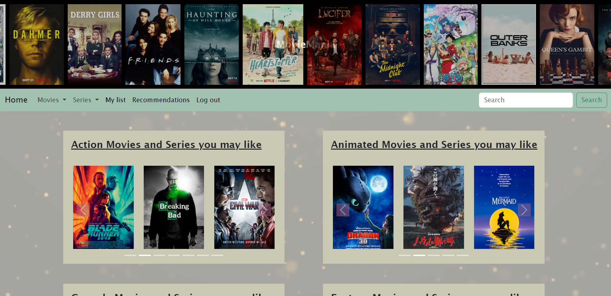
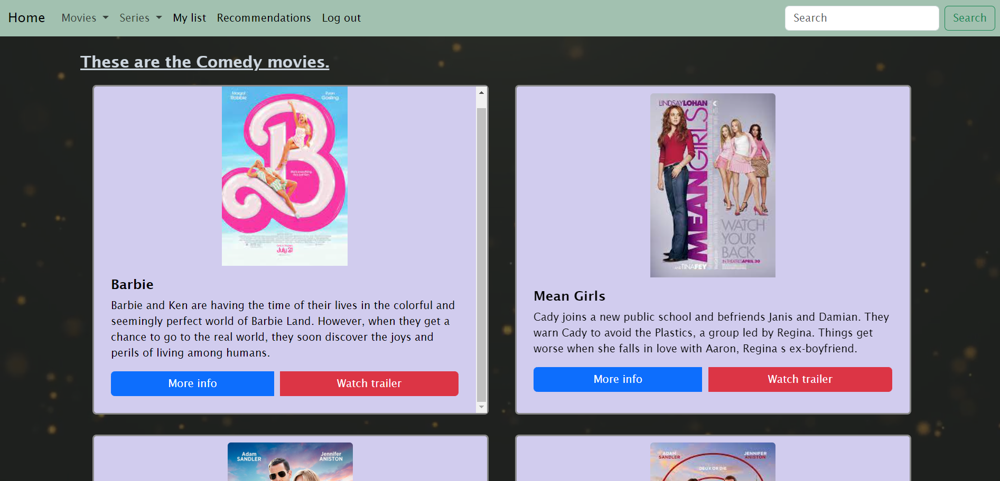
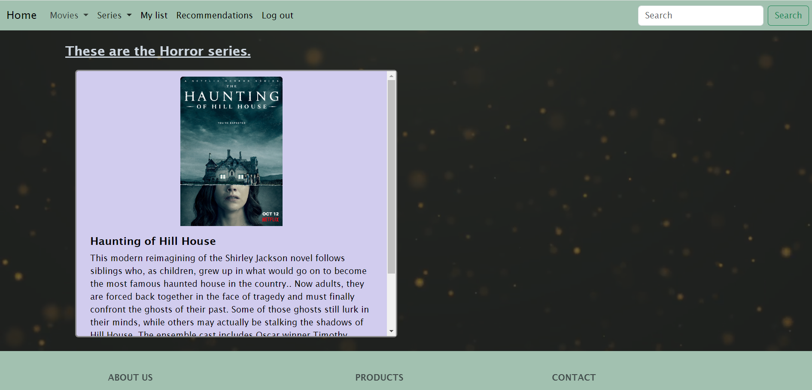
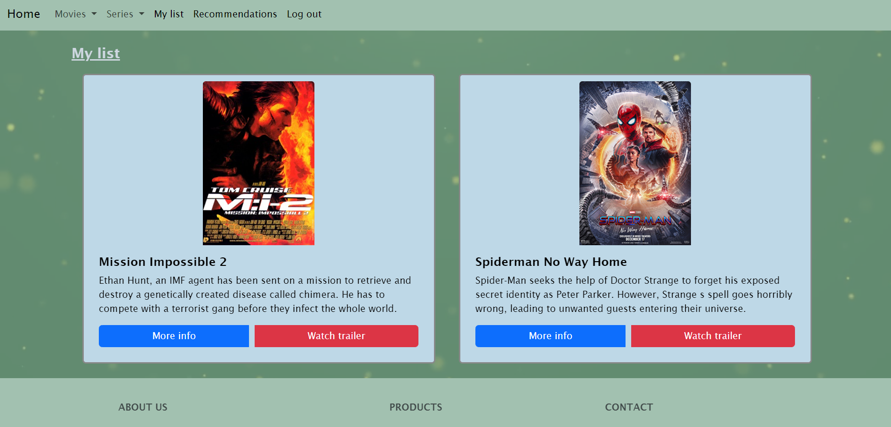
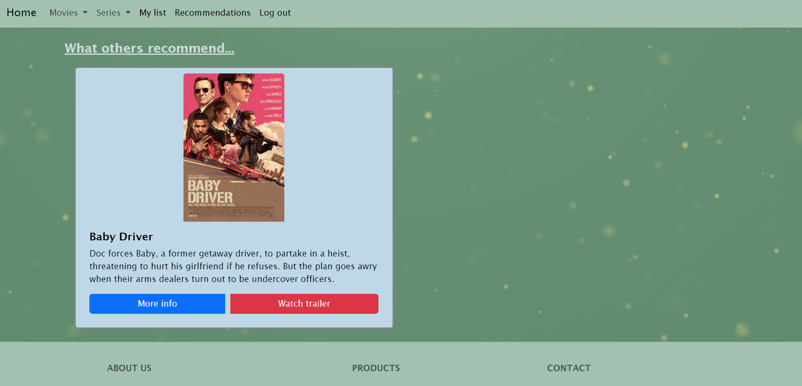

# Movies and Shows Website

## Description

The aim of this project was to create a website that contains popular movies and shows of different genres. Specifically, the user can filter on the type (movie or show) and the genre they want to watch as well as search for a specific movie/show. Each movie/show includes the trailer, some information about the plot as well as a link to further details. Moreover, the website allows the user to like a movie and put in on their list, which they can check at any time, as well as to get recommended movies and shows that other users have liked based on whether they have similar liked movies/shows on their lists. 

## Files

Begin by **downloading the .zip file and extracting all the contents**. After extracting the files, you will be able to see an "images" folder, .php files and .css files. The "images" folder includes a subfolder with all the movies, a subfolder with all the shows as well as a video that is used for the background of the website. 

Regarding the files, the .css filed are for customisation and to add characteristics to the elements. There is a .css file for the signup page, a .css file for the login page and the same goes for the page with specific genres, the page for the list and the recommendations, the main page and the page for the results of the search. 

As for the .php files, the ones that contain the word "page" are the ones that will be displayed to the user whereas the other ones are to receive, send and manipulate data and commands. Specifically:
- dbconfig.php: database configuration, creates the database and the tables and connects to the database
- getlikedmovie.php: gets the name of the movie that the specific user liked and adds it to a table with all the movies/shows that the user has liked
- getmovies.php: gets the movies/shows of the specific genre that the user chose
- getmylist.php: gets the list with all the movies that the user has liked
- getrecommendation.php: gets the movies that other users have liked. If user 1 and user 2 have both liked the same movie, then user 1 will get as recommendations all the movies that user 2 has liked (this applies for more users as well)
- getsearch.php: gets the movies that match what the user has searched
- login_page.php: the page that gets the username and the password and if those are correct, it directs the user to the main page. Otherwise, it throws an error
- main_page.php: the main page that is displayed, it contains movies and shows based on genres and the navigation bar can lead to movies or shows of a specific genre, the list with the liked movies, the recommendations or the search results
- movie_genre_page.php: displays the movies based on a specific genre that the user has chosen
- mylist_page.php: displays the list with all the liked movies and shows of the specific user
- recommendation_page.php: displays the recommended movies for the specific user
- search_page.php: displays the results of what the user has searched
- series_genre_page.php: displays the shows based on a specific genre that the user has chosen
- signup_page.php: the initial page of the website. Open this page in order to properly use the website (opening any other page first will not display some of the elements of the website, so in order to use it as intended, open this page first). It gets a username, a password and the age of the user and if the username doesn't already exist, then the user is directed to the website. If the username already exists, it throws an error.

**Steps**
- You will need an app that can connect you to a web server, such as XAMPP or UwAmp or any other app you prefer that can do this job.
- Download the zip file and extract all of its contents (no matter what app you downloaded on the previous step, you will have to put the project to the correct folder).
- After downloading such an app, open the signup_page.php and signup as a user of the website. The details for the signup do not need to be very personal, but you should be able to remember them in case you want to log in at a later time. (If you use Visual Studio Code, download an "Open in Browser" plugin and open the page from there).
- Explore the website and when you are done, log out.
- In order to check the recommendations mechanism, create 2 accounts: user1 and user2. Add some movies and shows to the liked lists of the users. Add at least one common movie/show to the list of both. When you log out of user1 and login to user2, you will be able to see the movies/shows that user1 has liked just because user1 and user2 liked at least one same movie/show. This will work if a user3 existed and all three users had liked at least one same movie/show and they would get the list of each other. If you only have one account, there will be nothing to recommend because there are no other users that have created an account on the website.

## Code

For this project, 
- HTML was used for the basic structure of the website
- CSS was used for styling the elements
- JavaScript was used for making the website more interactive and adding some functionalities to it
- JQuery was used for document traversal and manipulation
- AJAX was used for exchanging and updating data with the web server
- PHP & MySQL were used for creating and establishing a connection with a database

## Pages

There are 8 pages in total: 
1. ***signup page***
   

2. ***login page***

 
3. ***main page***

4. ***page of movies for specific genres***

5. ***page of series for specific genres***

6. ***page of the list of the liked movies***

7. ***page of the recommended movies/shows***

8. ***page of the search results***

